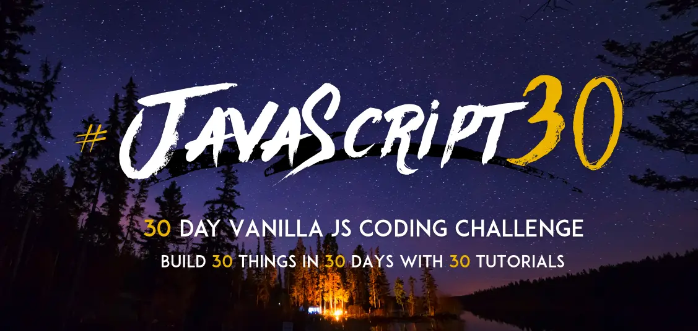



# JavaScript 30 Day Challenge

This repo contains all the challenges in the [JavaScript30](https://javascript30.com/) course organized by Wes Bos.

All the Source Code by Wes Bos. [GitHub Repo](https://github.com/wesbos/JavaScript30)

Big Thanks, Wes Bos, for your Amazing Course!

Now, I'm gonna coding this :)

30 days later...

Finally, I've finished.

Funny projects.

Great experience.

High recommend. 👍

5 Stars. ⭐

I solved almost all of them, besides 2 tasks (canvas & webRTC).
